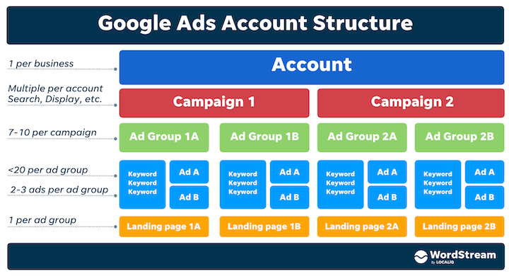

<h1 style="text-align: center;">Google Ads for Nonprofits</h1>

## Index

1. [Introduction](#introduction)
2. [Ad Grants](#ad-grants)
3. [First Ad campaign](#creating-the-first-ad-campaign)
4. [Maintainence](#maintaining-ad-campaigns-and-improving)
5. [Questions and troubleshooting](#questions-and-troubleshooting)
6. [Resources](#resources)
7. [Contact Information](#contact-information)

## Introduction

**Google Ads** is a pay-per-click (PPC) advertising platform that allows businesses
to display ads on Google's search engine results pages (SERPs) and other
websites that are part of the Google Ads network. When a user searches for a
keyword or phrase that is relevant to the business's products or services, the
business's ad may appear at the top or bottom of the SERPs. If the user clicks
on the ad, they will be taken to the business's website, and the business will
be charged a fee by Google.

To get started with Google Ads, businesses need to create an account and set up
a campaign. During the campaign setup process, businesses will choose the
specific keywords they want to trigger their ads, set a budget for the campaign
, and choose the target audience for their ads. They will also create the actual
ad copy and design the ad's appearance.

Once the campaign is set up, Google's algorithms will automatically determine
which ads to show to which users based on a variety of factors, including the
user's search query, location, and past browsing history. The ads are ranked
based on a combination of the bid amount (the amount the business is willing to
pay for a click on their ad) and the ad's relevance and quality.

Google Ads provides detailed reporting and analytics tools to help businesses
track the performance of their campaigns and optimize them for better results.
With these tools, businesses can see how many people have seen their ads, how
many people have clicked on their ads, and how many people have taken a specific
action on their website (such as making a purchase). This allows businesses to
continuously fine-tune their campaigns to improve their return on investment
(ROI). This document will explain the steps taken to create a new campgain in
Google Ads. It will also explain the multiple decision during the process.
Additionally, the documentation will explain some of the errors that have
appeared along the way.

## Ad Grants

**Google Ads** offers organizations up to $10,000 USD per month to advertise
search Ads. However, organizations have to follow certain requirments:

- Your organization must be an [eligible nonprofit](#eligible-nonprofit-organization).
- Have a high-quality website that meets Google [website policy](#website-policy).
- Be able to meet the [program policies](#program-policies).

Once the account is set up, the nonprofit organization can create and manage
their Google Ads campaigns in the same way as any other business using Google
Ads. They can choose the specific keywords they want to trigger their ads,
set a budget for the campaign, and choose the target audience for their ads.

#### Eligible Nonprofit Organization

To be eligible for Google Ad Grant, an organization must:

- Be register as a **charitable organization** in one of the countries listed by Google.
- Meet the requirements in its own country.
- Agree to the <a href="https://support.google.com/nonprofits/answer/9004493?hl=en" target="_blank">
  Google for Nonprofits Additional Terms of Service</a>.

Your organization is NOT eligible for Google for Nonprofits if it is:

- A government entity or organization.
- A hospital or health care organization.
- A school, academic institution, or university.

For more information about eligible countries and country requirements, please visit
<a href="https://support.google.com/nonprofits/answer/9004493?hl=en" target="\_blank">
Google Eligibility guidelines</a>.

#### Website Policy

Google Ad Grant has a set of policies that nonprofit organizations must follow
in order to maintain their eligibility for the program. These policies are
designed to ensure that Google Ad Grant is used in a way that is consistent
with the program's mission of helping nonprofit organizations promote their
causes and reach a wider audience.

- Your organization must own the domain that users land on when they click
  your ad.
- Active website: The organization must have an active website that is
  available to the public and provides information about the organization's
  mission, programs, and services.
- Destination: Ads must link to pages on the organization's mission and
  programs. Ads cannot link to pages that promote products or services for
  sale, or that solicit donations in exchange for goods or services.
- Content: The organization's website must contain high-quality, original
  content that is relevant to the organization's mission and programs. Websites
  that contain primarily commercial content or that are not directly related to
  the organization's mission are not eligible for Google Ad Grant.

For more information about Google website policies, please visit <a 
href="https://support.google.com/grants/answer/1657899?hl=en" target="_blank">
Website Policy</a>.

#### Program Policies

Please visit <a
href="https://support.google.com/grants/topic/3500093?hl=en&ref_topic=3500091,3500123,3540513"
target="_blank">Program policies</a> to review and check all the policies and
additional requirements set by Google.

## Creating the first Ad campaign

Creating the first Ad campaign with no experience can be very challenging,
therefore, one should be extra careful with the planning and publishing of Ads.

First one should understand how Google Ads is organized. In order to create an
Ad campaign, Google Ads follow a specific structure per account.

1. Sign up for a Google Ads account. If you don't already have one, you can create a new
   account by visiting the Google Ads website and clicking the "Sign up now" button.
   If your organization is part of the Google Ad Grants program, you should alread have an
   account to login to your account.
2. Choose your campaign type. When setting up your campaign, you will need to choose the
   type of campaign that best fits your goals. There are several campaign types to choose
   from, including Search, Display, Video, and Shopping. Remember that Ad grants only
   provides money for Search campaigns.
3. Set your budget. Decide how much you are willing to spend on your ad campaign and
   set a budget accordingly. You can choose to set a daily budget or a lifetime budget
   for your campaign.
4. Choose your target audience. Use the targeting options available in Google Ads to
   specify the demographics, interests, and locations of the people you want to reach with
   your ads.
5. Create your ad. Use the ad creation tools in Google Ads to design and write your ad.
   You will need to choose a headline, write a description, and add any images or graphics
   you want to include in your ad.
6. Choose your keywords. Select the keywords that you want to trigger your ads. These
   should be relevant to your business and the products or services you are promoting.
7. Set your bid. Choose how much you are willing to pay for a click on your ad.
   Google's algorithms will use this bid, along with the relevance and quality of
   your ad, to determine where your ad appears on the search engine results page.
8. Launch your campaign. Once you have set up your campaign, you can launch it
   by clicking the "Start campaign" button. Your ads will start running as soon
   as your campaign is approved by Google.

Try to use as many resources as needed. The best advice I can give is try to think
as the customers, try to think what they would search to get to your website, does
the Ad correctly represent the service promoted? Does the Ad follow all the policies
set by Google?

##### Summary

1. Create a campaign without a goal's guidance
   - Website Url: Campaign Name (The name should be descriptive for organization purposes).
   - Networks: Display or search (Keep in mind that Google Ad Grant only offers the search option).
   - Location: Try to specify and minimze the location.
   - Language: Languages the customers may speak. Start with the language that might receive
     more traffic and then continue with the others. Location and Language must work
     together.
   - Budget and Bidding: Google Ads will set the budget and bidding for the campaign, if the organization is a nonprofit.
   - Ad extension: "Get up 15% higher clickthrough rate by showing additional information on your ads."
   - Sitelink extensions: Lins to important parts in the organization's website like Subscribe page, Donations page,
     Mission, etc.
   - Callout extensions: Callout extensions are gray text, under the ad's description, showing the most important
     information about the Ad or organization.
2. Ad group
   - Recommendation: create an Ad group for each product sold or service in the website.
   - Ad group Name (Be Descriptive).
   - Keywords
     - Look over the program, item, or service promoted. Extract the best descriptive and popular
       keywords.
     - Use resources to check if the keywords have a considerable amount of traffic. (Not a
       large amount, a CONSIDERABLE amount).
     - Use match types to best target the desirable audience ("", [], !).
3. Create Ads
   - Make an Ad for each Ad group, or/and multiple Ads for the same Ad group.
     - Creating multiple Ads for the same Ad group could be helpful to target your audience
       on differenet seasons or different demographics.
   - Headlines
     - Google Ads will suggest keywords that could be included in the Ad, look over them
       and choose the best descriptive keywords.
     - Google Ads will also suggest to include "unique" keywords. Keywords may show action.
       For example: Suscribe now, 15% off, Over a 150 programs, Apply now, among others.
   - Description: In Google Ads description, try to give the customers a quick summary and explanation of the
     program promoted. Similar to headlines, encourage customers to take action.
   - Follow the recommendations given by Google Ads.
4. Billing
   - Enter payment information.
   - If the organization is accepted as a nonprofit organization, this step is not required.

## Maintaining Ad Campaigns and Improving

To maintain and improve your ads and keywods on Google Ads, consider the following best
practices:

- Monitor your campaign performance regularly. Use the reporting and analytics
  tools provided by Google Ads to track the performance of your campaigns and
  identify areas for improvement.
- Use negative keywords. Negative keywords allow you to exclude certain words or
  phrases from your campaigns, ensuring that your ads are only shown to people who
  are truly interested in your products or services.
- Use multiple ad groups. Organize your campaigns into multiple ad groups, each
  targeting a specific set of keywords and ad copy. This allows you to tailor your
  ads to specific audience segments and improve their relevance and performance.
- Test different ad copy and landing pages. Experiment with different versions
  of your ad copy and landing pages to see which ones perform the best.
- Use Google's Quality Score to your advantage. Google's Quality Score is a
  measure of the relevance and quality of your ads and keywords. By improving
  your Quality Score, you can lower your cost-per-click (CPC) and improve the
  placement of your ads.
- Keep your ad groups and campaigns organized. Regularly review and reorganize
  your ad groups and campaigns to ensure that they are still relevant and aligned
  with your goals.

By following these best practices, you can maintain and improve your ads and
keywords on Google Ads and get the best possible return on investment (ROI)
for you campaign.

Remember that if your organization is part of the Google Ad Grants
program, your ads need to have over a specific click through rate and
quality score.

## Questions and Troubleshooting

Google Ads provides a range of resources to help organizations understand the
process of using Google Ads and get the most out of their campaigns. These
resources include:

- Google Ads Help Center: The Google Ads Help Center is a comprenhensive
  resource that provides detailed information on how to use Google Ads, including
  step-by-step guides, tutorials, and FAQs.
- Google Ads Academy: Google Ads Academy is a free online learning platform
  that offers courses and training materials on Google Ads. The platform includes
  video lessons, quizzes, and hands-on exercises to help organizations learn how
  to use Google Ads effectively.
- Google Ads Support: Google Ads provides support to organizations through
  various channels, including email, phone, and online chat. Organizations can
  get help with creating and managing their campaigns, troubleshooting issues,
  and optimizing their campaigns for better results.
- Google Ads Partners: Google Ads has a network of certified partners that
  can provide additional support and expertise to organizations using Google Ads.
  These partners include agencies, consultants, and technology providers that
  specialize in helping organizations succeed with Google Ads.

There are also articles online that explain any question you might have.
Youtube is also a great resource to get the general knowledge of how Google Ads
works, however, do not only watch YouTube. It is also recommended to have a
general understanding about marketing; therefore, reading books, articles,
and taking in-person/online classes are more than helpful.

## Resources

In my research, I used a variety of resources to gain a thorough understanding
of the topic. These resources included online articles, tutorials, and
documentation provided by Google Ads, as well as information from industry
experts and practitioners. I also drew on my own experience with Google Ads,
including my own campaigns. This combination of resources and experience allowed
me to gain understanding of the topic and effectively analyze and
synthesize the information I gathered. Overall, the research process was very
informative and helped me to learn about the different aspects of using Google
Ads and how to optimize campaigns for success.

Some of the resources I used to write this document and that I applied
in Ad campaigns are:

- <a href="https://www.youtube.com/watch?v=a-JmhK9nKJk&t=71s" target="_blank">The Only Google Ads Tutorial You Will Ever Need (FOR BEGINNERS) </a>
- <a href="https://www.youtube.com/watch?v=_2eAXgvFOkg" target="_blank">How to Choose the Right Keywords for SEO</a>
- <a href="https://tools.wordstream.com" target="_blank">Free Keywords Tool</a>
- <a href="https://answerthepublic.com" target="_blank">Answer The Public</a>
- <a href="https://keywordtool.io" target="_blank">Keyword Tool</a>
- <a href="https://www.google.com/grants/faq/" target="_blank">Google Ad Grants - FAQ</a>

## Contact Information

If you still have questions about any of the steps or information given above, feel free
to contact me through email at <a href="mailto: jonathangon.2014@gmail.com" 
style="font-size: 15px;">jonathangon.2014@gmail.com</a>.

Written by Jonathan Gonzalez - 2023.

